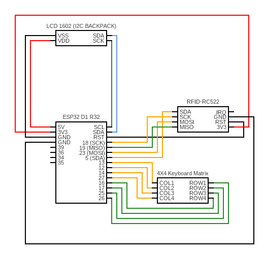

# PLUTO PAYMENTS - CARD READER
A lightweight embedded **card reader** that handles keypress instructions, provides feedback through a **16x2 LCD**, and integrates with the **RFID-RC522** module.  
This hardware implementation is part of the larger **Pluto Payments** ecosystem, which also includes a database, backend, and frontend.  

For the full project, check out the main repository: [Pluto Payments](https://github.com/lafftale1999/pluto_payments)

## Index
- [About](#about)
- [Usage](#usage)
- [Dependencies](#dependencies)
- [Setup](#setup)
- [Circuit Diagram](#circuit-diagram)
- [Pinout table](#pinout-table)
- [Build](#build)
- [From the author](#from-the-author)

## About
The project contains the following functions:
- **Real-time OS**: FreeRTOS with tasks and queue management  
- **Networking**: Wi-Fi with connect/disconnect logic  
- **User Interface**: 16x2 LCD for live feedback  
- **Input**: 4x4 keypad for device interaction  
- **Card Reader**: RFID-RC522 for secure card data reading  
- **Security**:  
  - SHA-256 hashing for sensitive values  
  - HTTPS with mutual TLS (mTLS)  
  - HMAC tokens for integrity and replay-attack protection  

## Usage

The device is **plug-and-play** once the installation guide (see below) is completed.  

1. Power on the device.  
2. Wait for the LCD screen to clear after connecting to Wi-Fi.  
3. Press any key on the **4x4 keypad** to wake the device.  
   - **A** → Start a payment  
   - **C** → Put device back to sleep  

> **Note:** The **C key** always acts as a *cancel button* throughout the entire program.  

---

### Creating a Payment

1. **Enter Amount**  
   - Input the amount (supports up to 2 decimal places).
   - Use **\*** to enter a decimal  
   - Use **D** to delete the last entered character.  
   - Press **A** to confirm the amount.  

2. **Scan Card**  
   - Present the card to the **RFID-RC522 reader**.  

3. **Enter PIN Code**  
   - PIN must be exactly **4 digits**.  
   - Use **D** to delete the last entry.  
   - Press **A** to confirm.  

4. **Send Payment Request**  
   - The device creates an **HTTPS request** over **mTLS**.  
   - Request includes **HMAC tokens** for integrity protection.  
   - The LCD will show feedback from the server response.  

   🔧 If you want to disable LCD response feedback, you can modify the function in [`https_implementation.c`](main/src/https_implementation.c):  

   ```c
   esp_err_t https_create_and_send_request(char *request_body, char *hmac, char *out, size_t out_size)
   ```

## Dependencies
The following dependencies are required to be able to build the project:

#### ESP-IDF
The Espressif IoT Development Framework. This project was build with version 5.4.1.

### Drivers
Some of the peripheral drivers are included in the component folder as submodules. Follow the setup guide in detail to correctly download them aswell.

## Setup

### 1. Clone the project
```sh
git clone --recurse-submodules https://github.com/lafftale1999/pluto_payments_hardware.git
```

### 2. Configure files

#### 2.1. project_config.h
This file is found here [components/project_config/project_config.h](components/project_config/project_config.h). Here you set the settings for the keypad, spi and i2c communication.

```c
#ifndef _PROJECT_CONFIG_H
#define _PROJECT_CONFIG_H


// SET UP FOR I2C COMMUNICATION. USED FOR THE LCD 16X2 SCREEN.
#define I2C_MASTER_SCL_IO           GPIO_NUM_22                  /*!< GPIO number used for I2C master clock */
#define I2C_MASTER_SDA_IO           GPIO_NUM_21                  /*!< GPIO number used for I2C master data  */
#define I2C_MASTER_NUM              I2C_NUM_0                   /*!< I2C port number for master dev */
#define I2C_MASTER_FREQ_HZ          100000                      /*!< I2C master clock frequency */
#define I2C_MASTER_TX_BUF_DISABLE   0                           /*!< I2C master doesn't need buffer */
#define I2C_MASTER_RX_BUF_DISABLE   0                           /*!< I2C master doesn't need buffer */
#define I2C_MASTER_TIMEOUT_MS       1000
#define I2C_DEVICE_ADDRESS_LEN      I2C_ADDR_BIT_LEN_7

// SET UP FOR SPI COMMUNICATION. USED FOR THE RFIC-RC522
#define RC522_SPI_BUS_GPIO_MISO    GPIO_NUM_19
#define RC522_SPI_BUS_GPIO_MOSI    GPIO_NUM_23
#define RC522_SPI_BUS_GPIO_SCLK    GPIO_NUM_18
#define RC522_SPI_SCANNER_GPIO_SDA GPIO_NUM_5
#define RC522_SCANNER_GPIO_RST     (-1) // soft-reset

// COLUMN AND ROW PINS USED FOR THE KEYPAD LOGIC
#define KEYPAD_ROW_PINS {GPIO_NUM_26, GPIO_NUM_25, GPIO_NUM_17, GPIO_NUM_16}
#define KEYPAD_COL_PINS {GPIO_NUM_27, GPIO_NUM_14, GPIO_NUM_12, GPIO_NUM_13}

#endif
```

#### 2.2. credentials.h
Create this file in [main/include/](main/include/)-directory and set up your credentials for both wifi, device key (used for hmac) and api end-points.

```c
#ifndef SECRET_CREDENTIALS_H
#define SECRET_CREDENTIALS_H

#define WIFI_SSID   "admin"
#define WIFI_PASS   "admin123"

#define DEVICE_KEY  "secret_key"

#define SERVER_HOST         "192.168.0.100"
#define PLUTO_URL           "https://192.168.0.100:443"
#define PLUTO_PAYMENT_API   "/device/authorize"

#endif
```

#### 2.3. Certificates and keys
For this solution you need the following:
* `client-cert.pem`
* `client-key.pem`
* `ca-cert.pem`

> **Note:** The client key and cert need to be signed by the same CA as `ca-cert.pem`. The server receiving the certificates also need to have it's own certificates (often keystore) signed by the same CA.
## Circuit Diagram

The project relies on the following components:  
- **ESP32** microcontroller  
- **16x2 LCD** (I²C)  
- **4x4 Keypad**  
- **RFID-RC522** card reader  

Below is the circuit diagram that shows how the components are connected:



> **Note:** Pin definitions can be found in [`project_config.h`](components/project_config/project_config.h)

## Pinout Table

| Component    | Signal        | ESP32 Pin | Notes                |
|--------------|--------------|-----------|----------------------|
| **LCD 16x2** | I2C SCL      | GPIO 22          | Clock line           |
|              | I2C SDA      | GPIO 21          | Data line            |
| **Keypad 4x4** | ROW0        | GPIO 26          | Send signal                     |
|              | ROW1         | GPIO 25          | Send signal                     |
|              | ROW2         | GPIO 17          | Send signal                     |
|              | ROW3         | GPIO 16          | Send signal                     |
|              | COL0         | GPIO 27          | Read signal                     |
|              | COL1         | GPIO 14          | Read signal                     |
|              | COL2         | GPIO 12          | Read signal                     |
|              | COL3         | GPIO 13          | Read signal                     |
| **RC522**    | SPI MISO     | GPIO 19          | Master in/slave out  |
|              | SPI MOSI     | GPIO 23          | Master out/slave in  |
|              | SPI SCK      | GPIO 18          | Serial clock         |
|              | SDA / SS     | GPIO 5          | Slave select (CS)    |
|              | RST          | -          | Reset pin            |


> **Note:** Pin definitions can be found in [`project_config.h`](components/project_config/project_config.h)

## Build
To build the project, open the ESP-IDF terminal and navigate to the project root `.../pluto_payments_hardware/`. Run the following commands:

1. Build command
    ```
    idf.py build
    ```

2. Flash command (change COM-port if needed)
    ```
    idf.py -p COM3 flash
    ```

3. Monitor command (change COM-port if needed)
    ```
    idf.py -p COM3 monitor
    ```

## From the Author

Working on this project has been an incredibly rewarding journey.  
It has challenged me to dive deeper into embedded systems development and apply concepts that I have little to no earlier experience with.

Some of the key takeaways for me have been:  
- Gaining practical experience with the **producer/consumer pattern** using FreeRTOS.  
- Building a stronger understanding of **opaque pointers** and why they matter in clean, maintainable C code.  
- Applying **secure communication practices** (mTLS, HMAC, SHA-256) in a real-world scenario.  
- Bridging the gap between **hardware integration** (RFID, LCD, keypad) and **networked systems**.  

It hasn’t always been easy—there were plenty of moments of trial and error—but each obstacle brought valuable insights into both **embedded development** and **software engineering best practices**.  

I believe projects like this show the importance of hands-on exploration beyond what’s covered in the curriculum.

---

**Feedback is always welcome!**  
If you have ideas for improvements, spot potential issues, or just want to discuss embedded systems, feel free to open an issue or reach out directly.  

You can contact me here on GitHub